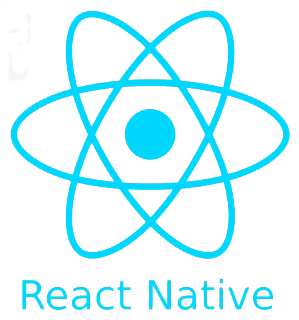

# MealsToGo

### Description:

This app is similar to yelp.

### How to create:

1. Clone repository
2. Run:

```
yarn install
```

3. Run:

```
yarn add expo eslint pretty-quick husky lint-staged --global
```

## Created with:

<p align="left">
    
</p><br/>

## Using Javascript Code Styles :

[](http://standardjs.com)
